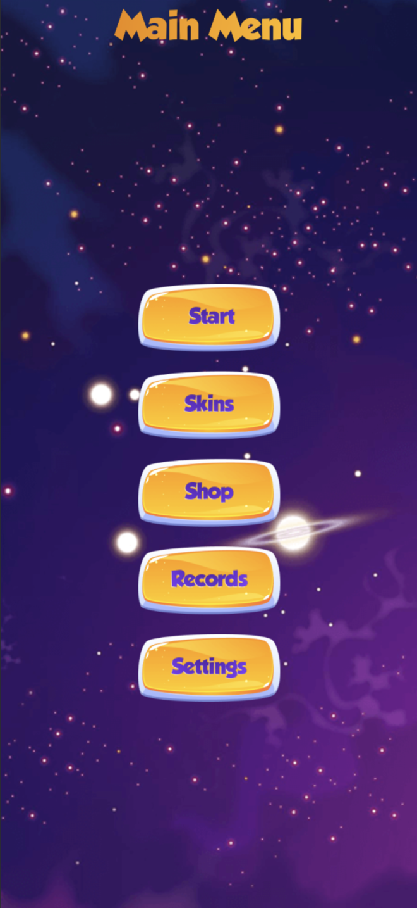
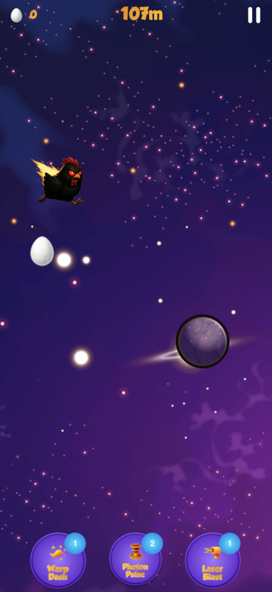
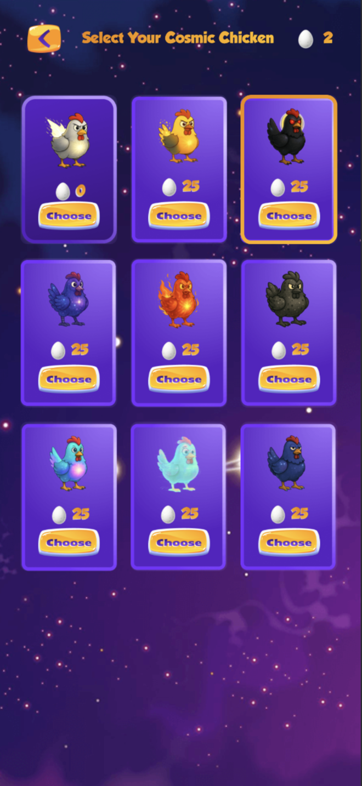
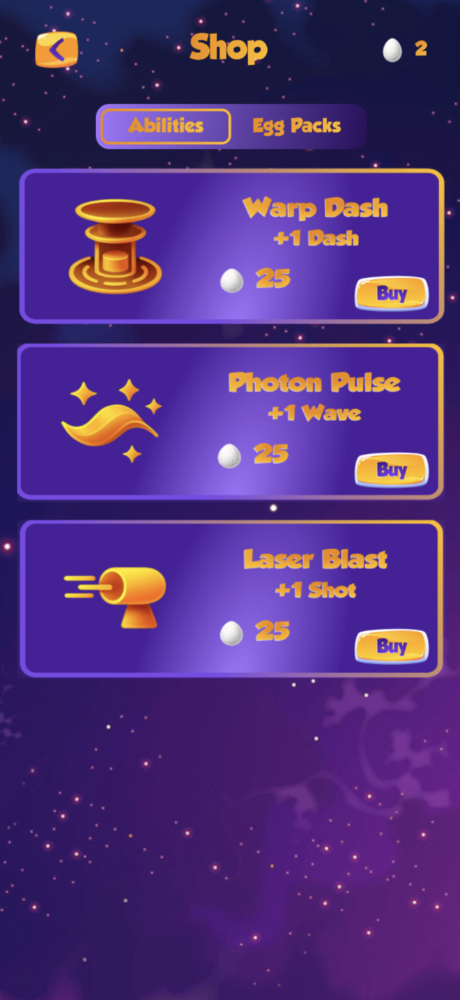
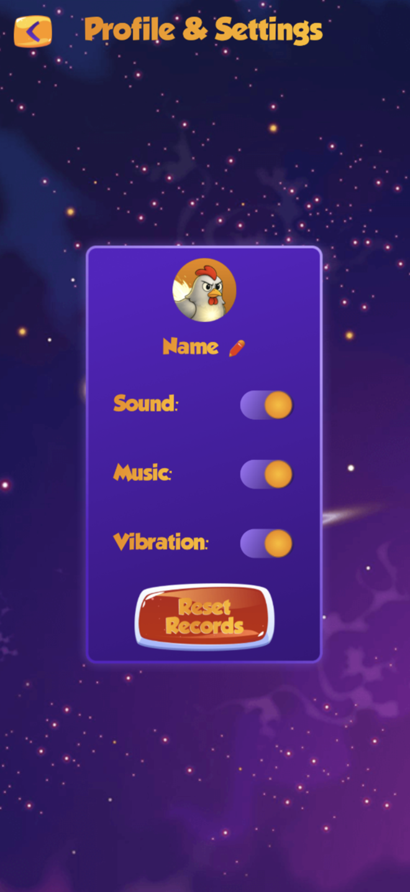

# Galactic Chicken Run 🐔🚀

**Galactic Chicken Run** is a thrilling 2D endless runner built with Kotlin Multiplatform. Control a space chicken running through cosmic tracks, dodge asteroids, collect space eggs, and unlock amazing cosmic skins across Android and iOS platforms!

## Gameplay 🎮

### Core Mechanics
- **Four-Lane Running**: Automatic chicken movement across parallel space lanes
- **Swipe Controls**: Instant lane switching with left/right swipes
- **Cosmic Abilities**: Three powerful space abilities with cooldown mechanics
- **Endless Challenge**: Survive as long as possible while collecting space eggs

### Special Abilities ⚡
**Warp Dash**:
- Teleport two lanes forward instantly

**Photon Pulse**:
- Emit energy wave pushing obstacles away for 4 seconds

**Laser Blast**:
- Destroy first obstacle in your lane with directed laser

## Features ✨

### 🎨 Cosmic Customization
- **Space Skins Collection**: 9 unique cosmic chicken designs
- **Skin Gallery**: 3×3 grid showcase with preview system
- **Purchase System**: Buy skins with collected space eggs
- **Active Skin Highlighting**: Visual indication of selected cosmic chicken

### 🛒 Space Commerce
- **Ability Shop**: Purchase extra ability charges
- **Egg Packages**: Real money purchases for space eggs
- **Upgrade System**: Enhance cosmic chicken abilities
- **In-App Purchases**: Currency packs

### ⚙️ Customization & Settings
- **Profile Management**: Custom nicknames and avatars
- **Audio Controls**: Sound, music, and vibration toggles
- **Progress Reset**: Fresh start option with confirmation

## Screenshots 📱

| Main Menu | Gameplay |
|-----------|----------|
|  |  |

| Cosmic Skins | Space Shop |
|------------- |------------|
|  |  |

| Leaderboard | Settings |
|-------------|----------|
|  |  |

## Tech Stack 🛠️

### Core Technologies
- **Language**: Kotlin
- **UI Framework**: Compose Multiplatform
- **Native in-app purchases**

---

*Run through the cosmos and become the ultimate space chicken! 🌟🐔*